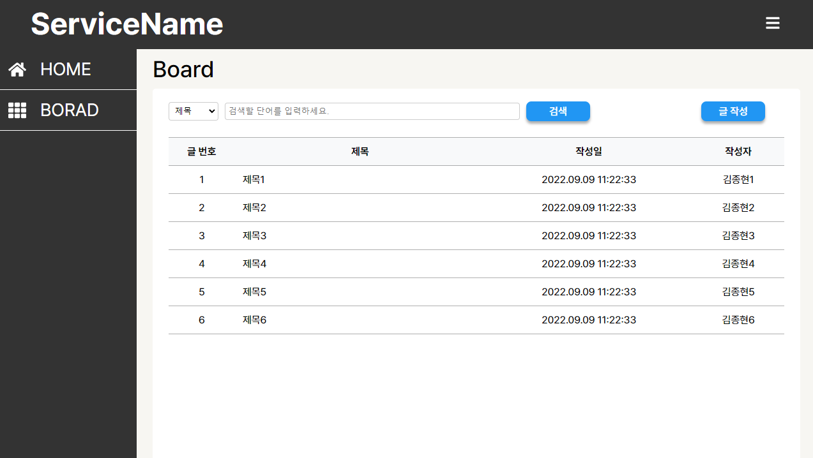
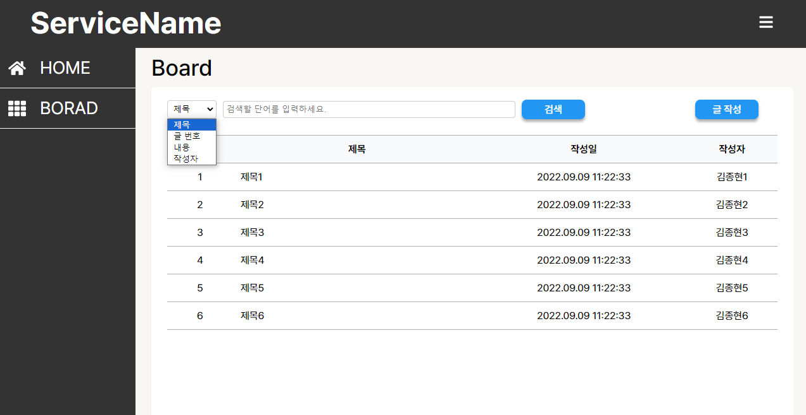
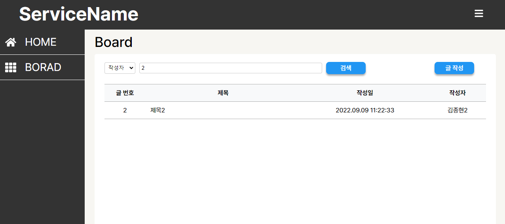
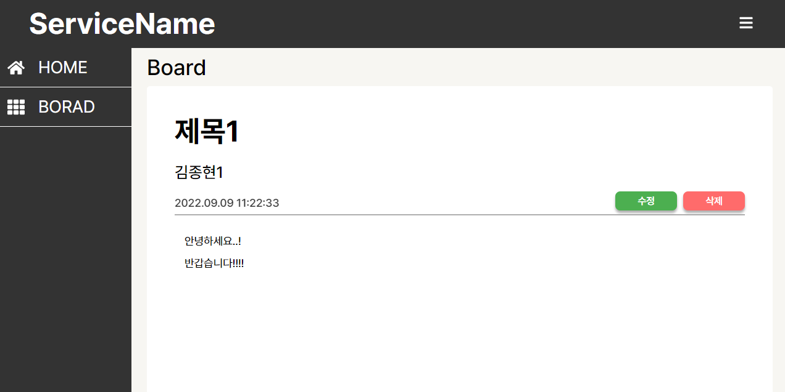
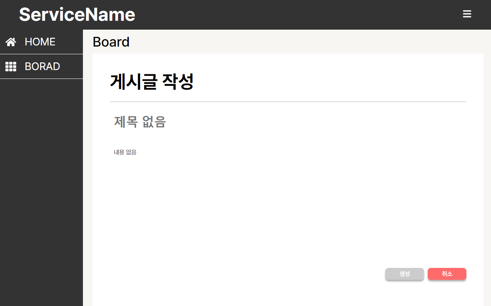
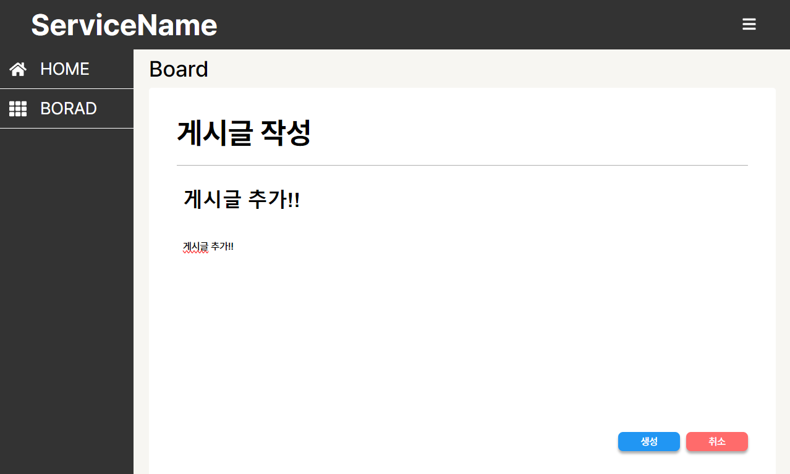
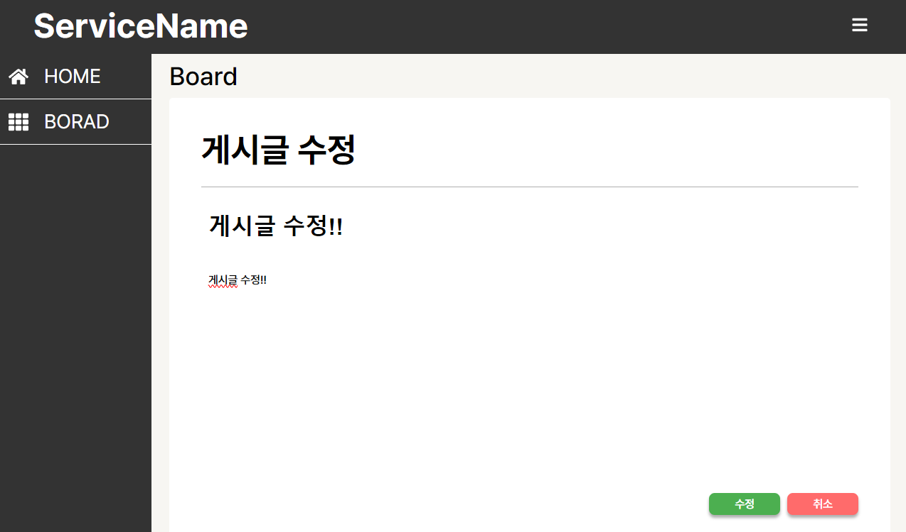

# Master Board

## 항해 플러스 사전 스터디 (프레임워크)

### React 프로젝트 설계

- 만능 게시판 소스 코드 만들기
- 프로젝트 요약
  - 언제 어디서든 게시판을 만들 필요가 있을 때, 참고해서 바로 적용 가능한 만능 소스 코드 베이스 제작
- 프로젝트 목표
  - 게시글 CRUD 기능
  - 게시글 검색 기능
  - 3rd party 라이브러리 의존성 없는 개발
  - 확장 가능한 기본 스타일 적용
  - 댓글 기능
  - 쉽게 이해가능한 클린 코드와 간결한 동작
  - React Hook 적극 활용하기
- 적용 기술
  - 프레임워크 : React CRA
  - Mocking : Git Repo
  - 스타일 : CSS
- Git의 Raw 데이터 조회 기능을 활용하여 fake fetch 기능 구현
- LocalStorage를 활용하여 fake CRUD 구현

### React 프로젝트 결과

목록 조회 페이지

  

필터 기능

  

상세 조회 페이지

  

게시글 추가 페이지

  

게시글 수정 페이지

  

### React 프로젝트 TODO

- 댓글 기능
